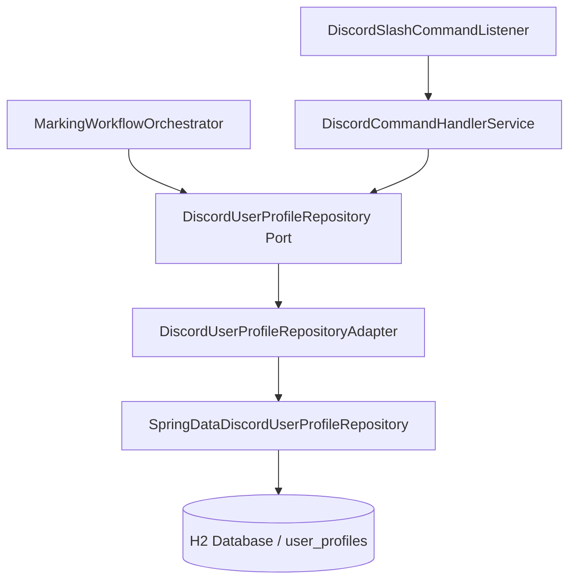

# Change Spec: Database Persistence for Credentials and User Profile (CAP-007)

## 1. Overview
This technical change specification defines the persistence mechanism for storing Discord users, user credentials (`bmaUsername`, `bmaPassword`), and user automation configurations (`maxEntryTime`, `jitterMinutes`, `active`) in a **MySQL relational database running via Docker Compose** using `Spring Data JPA`.

Currently, `DiscordCommandHandlerService` maintains user profiles in an in-memory `ConcurrentHashMap`. As a result, all registered user credentials and schedule configurations are lost whenever the application restarts. This change introduces database persistence, a domain repository port, a JPA repository infrastructure adapter, a `docker-compose.yml` MySQL container service, and updates the `MarkingWorkflowOrchestrator` to process active profiles retrieved from the database.

## 2. Research & Source Context
| Source | Location / Path | Purpose |
| --- | --- | --- |
| Discord Profile Model | [DiscordUserProfile.java](file:///c:/Users/lucas.dourado/IdeaProjects/auto-time-marking/src/main/java/com/lucasbdourado/autotimemarking/modules/interaction/discord/domain/model/DiscordUserProfile.java) | Domain model for Discord user profile and preferences |
| Discord Command Handler | [DiscordCommandHandlerService.java](file:///c:/Users/lucas.dourado/IdeaProjects/auto-time-marking/src/main/java/com/lucasbdourado/autotimemarking/modules/interaction/discord/service/DiscordCommandHandlerService.java) | Manages user registration, credentials, schedule, and pause/resume actions |
| Marking Orchestrator | [MarkingWorkflowOrchestrator.java](file:///c:/Users/lucas.dourado/IdeaProjects/auto-time-marking/src/main/java/com/lucasbdourado/autotimemarking/modules/workflow/service/MarkingWorkflowOrchestrator.java) | Executes workflow calculation and punch marking for configured users |
| Docker Compose Setup | [docker-compose.yml](file:///c:/Users/lucas.dourado/IdeaProjects/auto-time-marking/docker-compose.yml) | Docker container definition for MySQL database service |
| Build Specification | [pom.xml](file:///c:/Users/lucas.dourado/IdeaProjects/auto-time-marking/pom.xml) | Maven configuration for Spring Boot dependencies (MySQL driver) |
| Application Config | [application.properties](file:///c:/Users/lucas.dourado/IdeaProjects/auto-time-marking/src/main/resources/application.properties) | Spring datasource and JPA configuration for MySQL |

## 3. Confirmed Facts vs Assumptions

### Confirmed Facts
- Discord slash commands (`/register`, `/credentials`, `/config`, `/pause`, `/resume`, `/status`) allow users to register and manage their accounts via Discord.
- In-memory storage inside `DiscordCommandHandlerService` loses state on application restart.
- MySQL 8.4 is selected as the primary relational database, provisioned via `docker-compose.yml`.
- Spring Boot 3.4.1 uses `mysql-connector-j` driver and Hibernate MySQL dialect.

### Assumptions & Design Choices
- **Database Choice**: MySQL database provisioned in Docker container (`auto-time-marking-mysql`) exposed on port 3306.
- **Test Execution**: In-memory H2 database is retained in test scope for fast, self-contained unit and integration testing (`mvn clean test`).
- **Repository Architecture**: Follow Clean Architecture by defining a domain repository interface `DiscordUserProfileRepository` in `modules.interaction.discord.domain.port` and a Spring Data JPA implementation (`DiscordUserProfileEntity` + `SpringDataDiscordUserProfileRepository`) in `modules.interaction.discord.infrastructure.persistence`.
- **Workflow Orchestration**: `MarkingWorkflowOrchestrator` will load all active profiles from `DiscordUserProfileRepository`. If no active database profiles exist, it will fall back to default properties configured in `application.properties`.

## 4. Current vs Expected Behavior

### Current Behavior
- User profiles are held in a `ConcurrentHashMap<String, DiscordUserProfile>` inside `DiscordCommandHandlerService`.
- Application restart completely erases registered credentials, custom schedule limits (`maxEntryTime`), jitter settings, and active/paused states.
- `MarkingWorkflowOrchestrator` only reads static default credentials from `bmaquiosque.username` / `bmaquiosque.password` properties.

### Expected Behavior
- User profiles, BMA credentials (`username`, `password`), schedule configurations (`maxEntryTime`, `jitterMinutes`), and state (`active`) are persisted to the MySQL relational database table `user_profiles`.
- Re-starting the application or container preserves all registered users and settings.
- `DiscordCommandHandlerService` reads and updates user profiles via `DiscordUserProfileRepository`.
- `MarkingWorkflowOrchestrator` queries `DiscordUserProfileRepository.findAllActiveProfiles()` and executes daily marking cycles for every active user profile. If the database is empty, it falls back to the default property profile to maintain backward compatibility.

## 5. Scope & Out of Scope

### In Scope
- Adding `mysql-connector-j` dependency to `pom.xml`.
- Creating root `docker-compose.yml` for MySQL container service (`mysql:8.4`).
- Configuring MySQL datasource, JPA dialect, and schema auto-generation (`ddl-auto=update`) in `application.properties`.
- Creating `DiscordUserProfileEntity` and `SpringDataDiscordUserProfileRepository` infrastructure classes.
- Defining `DiscordUserProfileRepository` domain port and implementation.
- Refactoring `DiscordCommandHandlerService` to use `DiscordUserProfileRepository`.
- Updating `MarkingWorkflowOrchestrator` to fetch active profiles from `DiscordUserProfileRepository`.
- Updating unit and integration tests for service and workflow components.

### Out of Scope
- Advanced field-level AES encryption key management service – simple database persistence is implemented in this phase.


## 6. Functional Acceptance Criteria

### AC-001: Profile & Credential Persistence
**Given** a user registering and setting credentials via Discord (`/register`, `/credentials`)  
**When** the application is restarted  
**Then** the stored user profile, BMA username, and BMA password persist in the database and can be retrieved via `/status`.

### AC-002: Schedule Configuration Persistence
**Given** a user modifying schedule parameters (`/config max_entry:08:30 jitter:10`)  
**When** the configuration is saved  
**Then** the new `maxEntryTime` ("08:30") and `jitterMinutes` (10) are updated in the database record for that Discord user ID.

### AC-003: Multi-User Workflow Execution
**Given** multiple active user profiles stored in the database with valid BMA credentials  
**When** `executeMarkingCycle()` runs  
**Then** the orchestrator evaluates and executes the marking cycle individually for each active user.

### AC-004: Backward Compatibility Fallback
**Given** an empty database with no registered user profiles  
**When** `executeMarkingCycle()` runs  
**Then** the orchestrator falls back to processing the single default profile configured in `application.properties`.

## 7. Technical Design & Component Changes

### 7.1 Database Schema (`user_profiles`)
```sql
CREATE TABLE user_profiles (
    discord_user_id VARCHAR(255) PRIMARY KEY,
    bma_username VARCHAR(255),
    bma_password VARCHAR(255),
    max_entry_time VARCHAR(10) NOT NULL DEFAULT '09:00',
    jitter_minutes INT NOT NULL DEFAULT 5,
    active BOOLEAN NOT NULL DEFAULT TRUE,
    created_at TIMESTAMP,
    updated_at TIMESTAMP
);
```

### 7.2 Component Architecture


## 8. Validation References & Regression Risks
- **Automated Tests**: Run `mvn clean test` ensuring all tests pass, including new JPA repository tests and updated `DiscordCommandHandlerServiceTest` and `MarkingWorkflowOrchestratorTest`.
- **Regression Risk**: Low. If database initialization fails or repository is empty, fallback mechanism ensures single-tenant default properties mode continues to work cleanly.

## 9. Sequential Implementation Checklist

- [x] **TASK-1**: Add `spring-boot-starter-data-jpa` and `h2` dependencies to `pom.xml` and configure datasource properties in `application.properties`.
- [x] **TASK-2**: Create domain repository port `DiscordUserProfileRepository` in `modules.interaction.discord.domain.port`.
- [x] **TASK-3**: Create infrastructure entity `DiscordUserProfileEntity`, Spring Data JPA interface `SpringDataDiscordUserProfileRepository`, and adapter implementation in `modules.interaction.discord.infrastructure.persistence`.
- [x] **TASK-4**: Refactor `DiscordCommandHandlerService` to delegate storage operations to `DiscordUserProfileRepository`.
- [x] **TASK-5**: Update `MarkingWorkflowOrchestrator` to iterate over active database profiles (or fallback to default property profile).
- [x] **TASK-6**: Update and expand unit tests (`DiscordCommandHandlerServiceTest`, `MarkingWorkflowOrchestratorTest`) and add repository integration tests.
- [x] **TASK-7**: Verify full build and test execution using `mvn clean test`.

