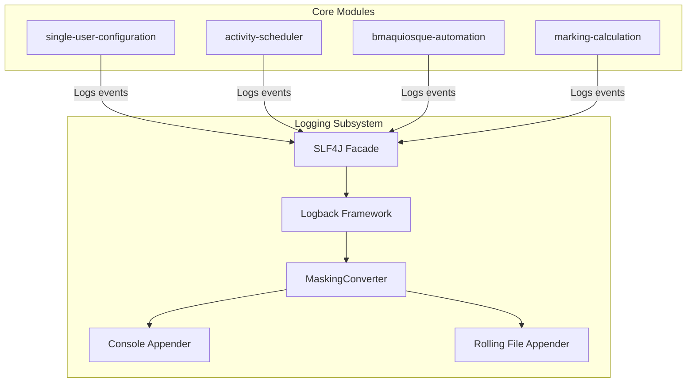

# Feature Technical Specification: audit-logging

## Status

Status: Confirmed

Last updated: 2026-07-14

Owner or primary stakeholder: Lucas Dourado

## Product Name

Auto Time Marking

## Feature Reference

`docs/features/audit-logging/feature.md`

Target output path: `docs/features/audit-logging/tech-spec.md`

## Source Documents

| Source | Location or Reference | Type | Status | Notes |
| --- | --- | --- | --- | --- |
| Feature | `docs/features/audit-logging/feature.md` | Feature | Confirmed | Primary feature source |
| Project Planning | `docs/planning/auto-time-marking/project-planning.md` | Planning | Confirmed | MVP context, phases, dependencies |
| Technology Definition | `docs/architecture/auto-time-marking/technology-definition.md` | Technology definition | Confirmed | Confirmed stack and constraints |

## Specification Scope

This technical specification covers the configuration and deployment of the application logging framework. It details the:
- Logback configuration (`logback-spring.xml`) for both Console and Rolling File appenders.
- Message format patterns, file storage paths, and log rotation policies.
- Custom security filter/converter logic to mask sensitive credentials (e.g., passwords).
- Standard logging APIs for developers to use throughout the codebase.
- Testing and verification approach for logging behavior.

## Feature Summary

The `audit-logging` feature provides the application with a file-based auditing mechanism. In the absence of a database or user interface in the MVP, log files are the primary diagnostic source. The service utilizes SLF4J and Logback to output structured, formatted logs to the console and to rolling log files on disk. Additionally, a dedicated converter will intercept logs and mask sensitive data to ensure credentials are never leaked.

## Feature Goal

Create a logging subsystem that records detailed logs of all scheduler events, marking evaluations, skips, successes, retries, and errors to rotating files.

## Product Completion Criteria

- [ ] Log messages formatted with Timestamp, Level, Thread, and Message.
- [ ] Successful runs, skips, retries, and errors are logged.
- [ ] Rolling log files verified.

## Technical Goals

- Set up SLF4J + Logback natively inside Spring Boot 3.4.x.
- Enforce standard logging pattern format: `[Timestamp] [Thread] [Level] [Logger] - Message`.
- Implement automatic log rotation: limit individual file sizes to 10MB and retain a maximum of 5 historical files.
- Build a custom Logback message converter to strip or mask credentials from log statements.
- Define log level conventions (INFO, WARN, ERROR) for all system modules.

## Non-Goals

- Storing logs in a relational database or external cloud log aggregators (e.g., Datadog, Splunk) for the MVP.
- Real-time notification systems (e.g., sending Discord notifications on error) - deferred to Phase 2.
- A visual log-viewer interface or REST API to retrieve logs.

## Confirmed Technology Decisions

| Area | Decision | Source | Applies To | Notes |
| --- | --- | --- | --- | --- |
| Logging Abstraction | SLF4J | `technology-definition.md` | Entire codebase | Standard facade pattern. |
| Logging Provider | Logback | `technology-definition.md` | Entire codebase | Spring Boot default provider. |
| Configuration | `logback-spring.xml` | `technology-definition.md` | Infrastructure | Configured in `src/main/resources`. |
| Protection | Regex Masking Converter | `feature.md` | Logback outputs | Intercepts log formatting to mask passwords. |

## Pending Technology Decisions

| Area | Pending Decision | Impact on Feature | Required Next Step |
| --- | --- | --- | --- |
| None | None | None | None |

## Applicable Guidelines and References

| Reference | Path | Applies To | Usage |
| --- | --- | --- | --- |
| Java / Clean Architecture Guidelines | [.agents/docs/architecture/coding-guidelines/README.md](file:///.agents/docs/architecture/coding-guidelines/README.md) | Entire codebase | Organizes packages logically, keeping logging utility in shared infrastructure. |
| Estrutura de Pacotes | [.agents/docs/architecture/coding-guidelines/package-structure.md](file:///.agents/docs/architecture/coding-guidelines/package-structure.md) | Package structure | Place custom Logback components under `shared.infrastructure.logging`. |

## Proposed Technical Approach

### 1. Spring Boot Integration & SLF4J API
All Java classes requiring logging will use standard SLF4J Loggers:
```java
package com.lucasbdourado.autotimemarking.modules.example;

import org.slf4j.Logger;
import org.slf4j.LoggerFactory;

public class ExampleService {
    private static final Logger logger = LoggerFactory.getLogger(ExampleService.class);
    
    public void doSomething() {
        logger.info("Service action completed successfully.");
    }
}
```

### 2. Custom Logback Masking Converter
To prevent accidental credential leak (e.g., when logging configuration models or raw request/response strings), we will implement a custom Logback Converter extending `ch.qos.logback.classic.pattern.MessageConverter`.

The converter will look for patterns resembling:
* `password=xyz`
* `"password": "xyz"`
* `pass=xyz`

And replace the credential value with `******`.

**Masking Converter Class:**
- Name: `com.lucasbdourado.autotimemarking.shared.infrastructure.logging.MaskingConverter`
- Pattern matching regex: `(?i)(password|pass|secret|credentials?)\s*[:=]\s*['"]?([^\s'",;]+)['"]?`

### 3. Logback Configuration (`logback-spring.xml`)
The configuration will define:
* A `CONSOLE` appender writing to stdout.
* A `ROLLING_FILE` appender writing to `logs/auto-time-marking.log`.
* Log rotation using `SizeAndTimeBasedRollingPolicy`:
  - Active log file: `logs/auto-time-marking.log`
  - Rolled files pattern: `logs/archived/auto-time-marking-%d{yyyy-MM-dd}.%i.log`
  - Maximum file size: `10MB`
  - Maximum history/index: `5` files
  - Total cap capacity: `50MB`

## Architecture Notes



Logging is a cross-cutting concern. Modules communicate only with the abstract `org.slf4j.Logger` interface. The implementation, log format configuration, and log masking run entirely within the infrastructure layer in a decoupled manner.

## Modules and Responsibilities

| Module or Component | Responsibility | Inputs | Outputs | Notes |
| --- | --- | --- | --- | --- |
| `logback-spring.xml` | Configures console output, file appenders, log format pattern, log rotation parameters, and registers the custom Masking Converter. | Logback lifecycle hooks | Log outputs | Located under `src/main/resources/`. |
| `MaskingConverter` | Extends `MessageConverter` to intercept log strings and mask sensitive matching strings (like passwords) before they reach log appenders. | Raw log message | Clean/masked log message | Placed in package `com.lucasbdourado.autotimemarking.shared.infrastructure.logging`. |
| `SLF4J` | Standard logging API used across the codebase. | Logging statements | Formatted logs to Logback | Used in all classes. |

## Integration Contracts

Not applicable. The logging subsystem is local to the runtime environment, providing no endpoints or external APIs, but acting as a dependency for local classes.

## Data Model

Not applicable. The subsystem does not persist entities to a database.

## Data Contracts

Not applicable. Logs are write-only formatted text streams.

## API or Interface Design

Not applicable. Standard SLF4J `org.slf4j.Logger` interface is utilized.

## State and Error Handling

| State or Error | Trigger | Expected Behavior | User/System Feedback | Notes |
| --- | --- | --- | --- | --- |
| Success | Normal application flow | Write formatted message to log appenders | Visual confirmation in console/files | System operates normally |
| Disk Full / Permission Denied | Unable to write to local directory `logs/` | Fail safely. Logback falls back to stderr/stdout or prints internal status error. Do not crash the application. | Errors output to standard error console | Checked in startup and health verification |

## Validation Rules

| Validation | Applies To | Enforcement Point | Error Behavior | Notes |
| --- | --- | --- | --- | --- |
| Log Masking | Any log message argument | `MaskingConverter` execution | Replaces credential values with `******` | Prevents plain text password leakage |

## Security and Permissions

- **Log Masking**: Custom converter masks values associated with keys matching `password`, `pass`, `secret`, `credential`.
- **System Permissions**: The local folder `logs/` should have secure file permissions matching the runtime application user (e.g. read/write permissions only for the owner).

## Observability and Logging

| Signal | Purpose | Source | Consumer | Notes |
| --- | --- | --- | --- | --- |
| INFO Logs | Track scheduler runs, check starts, successful markings, skips. | Code modules | Developer / Logs | Normal operations |
| WARN Logs | Track login retries, validation errors, temporary timeouts. | Code modules | Developer / Logs | Actionable but non-fatal |
| ERROR Logs | Track fatal exceptions, persistent failures after all retries, invalid boot configs. | Code modules | Developer / Logs | Critical alerts |

## Performance Considerations

- **Synchronous Output**: For a single-user system waking every 30 minutes, synchronous file operations do not present a bottleneck. Asynchronous appenders are not required for MVP.
- **Log Rotation**: Rotation triggers synchronously at 10MB. File renaming overhead is negligible.

## Compatibility and Migration Notes

Not applicable. This is a greenfield project.

## Testing Strategy

| Test Type | What to Validate | Required? | Notes |
| --- | --- | --- | --- |
| Unit | Validate `MaskingConverter` with strings like `password=mySecret`, `pass: "123"`, `secret=abc`, checking that they produce `password=******`, `pass: "******"`, etc. | Yes | Verifies security rules are applied. |
| Integration | Bootstrap Spring Boot container and check that the Logback context successfully initializes without errors. | Yes | Verifies `logback-spring.xml` validity. |
| Manual | Run the application boot locally, verify that the `logs/auto-time-marking.log` file is successfully created, and verify that size rotation operates correctly when writing simulated bulk data. | Yes | Verified on developer machine. |

## Risks and Trade-offs

| Risk or Trade-off | Impact | Likelihood | Mitigation or Follow-Up | Status |
| --- | --- | --- | --- | --- |
| Regex processor performance | Low | Low | Keep masking regex simple and optimized to avoid high CPU overhead. | Mitigated |
| Disk space depletion | Medium | Low | Maintain strict Logback file size limit (10MB) and history count (5). | Mitigated |
| Logger masking bypass | Low | Low | Instruct developer never to construct log strings with bare passwords outside logging placeholders (e.g., use config references instead). | Open |

## Assumptions

- No biometric or CAPTCHA bypass logs are required as those are out of scope.
- Logback has write permissions in the local application execution folder.

## Open Questions

| Question | Impact | Blocks Create Tasks? | Suggested Owner |
| --- | --- | --- | --- |
| None | None | No | None |

## Feature Technical Readiness

Status: Ready for Task Breakdown

Reason:
All mandatory documents are present. The logging system requires no external integrations, database storage, or complex business logic. The architecture parameters (rotation boundaries, levels, custom masking regex, and package structure) are fully defined.

## Feature Technical Readiness Checklist

- [x] Feature scope is clear.
- [x] Product completion criteria are understood.
- [x] Technology decisions are confirmed.
- [x] Applicable guidelines and references are listed.
- [x] Integration contracts are defined or marked as not applicable.
- [x] Data model is defined or marked as not applicable.
- [x] Data contracts are defined or marked as not applicable.
- [x] State and error handling are defined.
- [x] Validation rules are defined or marked as not applicable.
- [x] Security/permission considerations are defined or marked as not applicable.
- [x] Testing strategy is defined.
- [x] Blocking open questions are resolved.
- [x] Inputs for `create-tasks` are clear.

## Inputs for Create Tasks

- Create task for logging framework configuration (`logback-spring.xml` console and rolling appenders).
- Create task for log masking utility/converter class (`MaskingConverter`) and regex validation unit test.
- Create task for feature completion verification (validating file generation, formatting, and rotation limits).

## ADR Candidates

| Candidate ADR | Decision Area | Status | Reason |
| --- | --- | --- | --- |
| None | None | None | Local implementation details. |

## Next Recommended Steps

- Proceed to the **Task Breakdown** (`create-tasks`) phase for the `audit-logging` feature.
