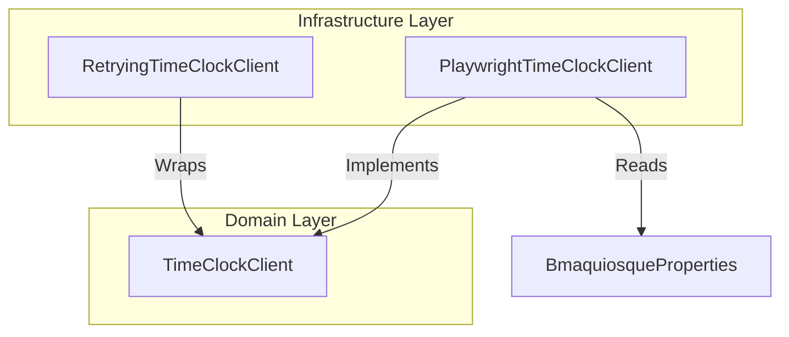

# Feature Technical Specification: bmaquiosque-automation

## Status

Status: Confirmed

Last updated: 2026-07-15

Owner or primary stakeholder: Lucas Dourado

## Product Name

Auto Time Marking

## Feature Reference

`docs/features/bmaquiosque-automation/feature.md`

Target output path: `docs/features/bmaquiosque-automation/tech-spec.md`

## Source Documents

| Source | Location or Reference | Type | Status | Notes |
| --- | --- | --- | --- | --- |
| Feature | [feature.md](file:///c:/Users/lucas.dourado/IdeaProjects/auto-time-marking/docs/features/bmaquiosque-automation/feature.md) | Feature | Confirmed | Primary feature source |
| Project Planning | [project-planning.md](file:///c:/Users/lucas.dourado/IdeaProjects/auto-time-marking/docs/planning/auto-time-marking/project-planning.md) | Planning | Confirmed | MVP context, phases, dependencies |
| Technology Definition | [technology-definition.md](file:///c:/Users/lucas.dourado/IdeaProjects/auto-time-marking/docs/architecture/auto-time-marking/technology-definition.md) | Technology definition | Confirmed | Confirmed stack (Java 21, Spring Boot, Playwright for Java) |

## Specification Scope

This specification details the technical design for the automated web browser interaction engine required to communicate with BMAquiosque. It covers browser instantiation and lifecycle, login automation, scraping and parsing of daily marking records, click trigger simulation for registering new markings, error screenshot capture for diagnostic audit, and a decorator-based exception-driven retry handler.

## Feature Summary

This feature provides the automation bridge between the Auto Time Marking backend service and the external BMAquiosque platform. It uses Playwright for Java to spin up a headless Chromium instance, navigate to the target login page, input user credentials, and navigate the platform's dashboard. It supports two primary operations: retrieving today's chronological punched times from the history dashboard, and clicking the register punch button. If any action fails, the system captures a screenshot of the current viewport to a logs directory and retries the entire execution sequence up to 3 times with a 5-minute interval between attempts.

## Feature Goal

Implement automated web browser navigation to interact with the BMAquiosque platform—performing user login, retrieving the list of currently registered punches for today, and submitting new time punches.

## Product Completion Criteria

- [ ] Headless browser instantiation and management configured via Playwright.
- [ ] BMAquiosque login form submission automated.
- [ ] Marking list retrieval and parsing into structured objects implemented.
- [ ] Marking click trigger simulation implemented.
- [ ] Exception-driven retry wrapper (up to 3 attempts, 5-minute sleep between retries) implemented.

## Technical Goals

- Establish Playwright client with try-with-resources statement to guarantee browser process teardown on each execution cycle.
- Make BMAquiosque URL and selectors configurable in `application.properties` to ensure modularity and ease of maintenance.
- Implement an automated screenshot capture on page load or action timeout to facilitate debugging UI changes.
- Decouple BMAquiosque interaction logic via a clean `TimeClockClient` interface, keeping automation mechanics out of scheduling and calculations modules.
- Ensure the Playwright engine runs in headless mode suitable for server execution.

## Non-Goals

- Storing BMAquiosque session cookies or attempting to keep persistent browser sessions active between scheduler runs.
- Bypassing CAPTCHAs, MFA (Multi-Factor Authentication), or geolocation constraints.
- Managing multiple users simultaneously (MVP is single-user focused).
- Directly determining the punch logic or timing decisions (delegated to the calculation module).

## Confirmed Technology Decisions

| Area | Decision | Source | Applies To | Notes |
| --- | --- | --- | --- | --- |
| Language & Runtime | Java 21 | `technology-definition.md` | Whole project | Native target |
| Framework | Spring Boot 3.4.x | `technology-definition.md` | Whole project | Application container |
| Browser Automation | Playwright for Java | `technology-definition.md` | `bmaquiosque-automation` | Fast, headless-native, auto-waiting library |
| Configuration | properties format | `technology-definition.md` | Properties loading | Target configuration format |
| Testing | JUnit 5 + Mockito | `technology-definition.md` | Unit/Integration Testing | For mock testing client logic |

## Pending Technology Decisions

| Area | Pending Decision | Impact on Feature | Required Next Step |
| --- | --- | --- | --- |
| None | None | None | None |

## Applicable Guidelines and References

| Reference | Path | Applies To | Usage |
| --- | --- | --- | --- |
| Java Guidelines | [.agents/docs/architecture/coding-guidelines/README.md](file:///.agents/docs/architecture/coding-guidelines/README.md) | Package structure & design | Domain/Infrastructure isolation rules |
| Playwright for Java reference | [playwright.md](file:///c:/Users/lucas.dourado/IdeaProjects/auto-time-marking/docs/references/auto-time-marking/technologies/playwright.md) | Automation implementation | Standard Playwright bootstrap conventions |

## Proposed Technical Approach

The `bmaquiosque-automation` feature will live under package `com.lucasbdourado.autotimemarking.modules.automation`.

### 1. Playwright Lifecycle management
To maximize reliability and prevent memory leaks or zombie OS processes, we will launch a fresh Playwright instance and headless Chromium browser on each check cycle. This lifecycle is managed using a nested try-with-resources statement:

```java
try (Playwright playwright = Playwright.create()) {
    try (Browser browser = playwright.chromium().launch(new BrowserType.LaunchOptions().setHeadless(true))) {
        try (BrowserContext context = browser.newContext()) {
            try (Page page = context.newPage()) {
                // Perform page interaction
            }
        }
    }
}
```

### 2. Configurable URL and Selector Strategy
We will extend `BmaquiosqueProperties` to include configuration settings for the BMAquiosque base URL and CSS selectors. This allows adjusting selectors on UI changes without requiring code modifications:
- `bmaquiosque.url`: The target platform login page.
- `bmaquiosque.selectors.username`: Selector for the user name text input.
- `bmaquiosque.selectors.password`: Selector for the password text input.
- `bmaquiosque.selectors.login-button`: Selector for the login submission button.
- `bmaquiosque.selectors.markings-container`: Selector for the element containing daily markings.
- `bmaquiosque.selectors.punch-button`: Selector for triggering the time register click.

### 3. Screenshot Capture on Failure
To diagnose selector failures, network issues, or landing page changes, any exception caught during automation will trigger a screenshot capture. The image will be saved to `logs/screenshots/` with the naming format `failure-[timestamp].png`.

### 4. Exception-Driven Retry Handler
An exception-driven retry handler will be implemented as a Decorator pattern wrapping `TimeClockClient`. If any call to `retrieveDailyMarkings` or `registerMarking` throws an exception, the decorator will log a warning, wait 5 minutes (`Thread.sleep`), and retry. It allows up to 3 total attempts before propagating the error to the calling scheduler.

## Architecture Notes

- **Package Layout**:
  - `com.lucasbdourado.autotimemarking.modules.automation.domain`: Contains port interface `TimeClockClient`.
  - `com.lucasbdourado.autotimemarking.modules.automation.infrastructure.playwright`: Contains the Playwright-based client implementation `PlaywrightTimeClockClient`.
  - `com.lucasbdourado.autotimemarking.modules.automation.infrastructure.retry`: Contains the decorator `RetryingTimeClockClient`.
- **Dependency Flow**:
  - Other modules (like `marking-calculation` or `scheduler`) depend only on `TimeClockClient` interface.
  - The implementation uses `BmaquiosqueProperties` for credentials, URL, and selector configuration.



## Modules and Responsibilities

| Module or Component | Responsibility | Inputs | Outputs | Notes |
| --- | --- | --- | --- | --- |
| `TimeClockClient` | Domain Port interface exposing time platform capabilities. | Credentials, commands | today's punches list, void | Decoupled from Playwright. |
| `PlaywrightTimeClockClient` | Headless Playwright implementation of `TimeClockClient`. | Credentials, `BmaquiosqueProperties` | List of `LocalTime`, void | Instantiates browser, manages pages, takes screenshots on error. |
| `RetryingTimeClockClient` | Decorator implementing retry logic on `TimeClockClient` calls. | `TimeClockClient` delegate | Today's punches list, void | Retries on exception up to 3 times, sleeping 5 minutes between. |

## Integration Contracts

Contracts between the application modules and the external BMAquiosque platform are simulated via headless browser HTTP interactions.

| Producer | Consumer | Contract | Notes |
| --- | --- | --- | --- |
| `TimeClockClient` | Scheduler/Calculations | `List<LocalTime> retrieveDailyMarkings(String user, String pass)` | Returns punches sorted chronologically |
| `TimeClockClient` | Scheduler/Calculations | `void registerMarking(String user, String pass)` | Submits a new time punch |

## Data Model

`Not applicable` — This feature does not persist data or manage domain models. Data remains transient within memory throughout the duration of the execution cycle.

## Data Contracts

### 1. Configuration Property Additions
The following new properties will be bound via `BmaquiosqueProperties`:

| Property Key | Type | Default Value | Description |
| --- | --- | --- | --- |
| `bmaquiosque.url` | String | `https://bmaquiosque.example.com` (Placeholder) | BMAquiosque landing URL |
| `bmaquiosque.selectors.username` | String | `input[name='username']` | CSS Selector for username field |
| `bmaquiosque.selectors.password` | String | `input[name='password']` | CSS Selector for password field |
| `bmaquiosque.selectors.login-button` | String | `button[type='submit']` | CSS Selector for login submission |
| `bmaquiosque.selectors.markings-container` | String | `.marking-time-text` | CSS Selector for parsed marking times |
| `bmaquiosque.selectors.punch-button` | String | `#btn-punch` | CSS Selector for punch button |

## API or Interface Design

### `TimeClockClient` Interface

```java
package com.lucasbdourado.autotimemarking.modules.automation.domain;

import java.time.LocalTime;
import java.util.List;

public interface TimeClockClient {
    /**
     * Authenticates with BMAquiosque and retrieves the list of time markings registered today.
     *
     * @param username user login name
     * @param password user login password
     * @return list of local times registered today, sorted chronologically
     * @throws Exception if connection, login, page navigation, or parsing fails
     */
    List<LocalTime> retrieveDailyMarkings(String username, String password) throws Exception;

    /**
     * Authenticates with BMAquiosque and registers a new time marking (punch) for today.
     *
     * @param username user login name
     * @param password user login password
     * @throws Exception if connection, login, or button click verification fails
     */
    void registerMarking(String username, String password) throws Exception;
}
```

## State and Error Handling

| State or Error | Trigger | Expected Behavior | User/System Feedback | Notes |
| --- | --- | --- | --- | --- |
| Successful Login | Credentials are valid on BMAquiosque | Page navigates to dashboard | Log: `Successfully logged in to BMAquiosque for user: [username]` | Normal flow starts |
| Login Failure | Incorrect credentials | Throws `IllegalStateException` | Error Log: `Login failed for user [username]. Invalid credentials.` | Screenshot saved, no retry |
| Element Timeout | Selector is not found within page timeout limit | Throws `PlaywrightException` or `TimeoutException` | Log: `Timeout waiting for selector [selector]` | Screenshot captured, triggers retry |
| Network Offline | Host is unreachable | Page navigation fails | Log: `BMAquiosque platform is unreachable` | Screenshot captured, triggers retry |
| Successful Punch | Punch button clicked and accepted | Verifies success element or dashboard reload | Log: `Time marking successfully registered` | Completes operation |

## Validation Rules

| Validation | Applies To | Enforcement Point | Error Behavior | Notes |
| --- | --- | --- | --- | --- |
| URL format | `bmaquiosque.url` | Startup validator (`BmaquiosquePropertiesValidator`) | Halt boot sequence | Must be a valid HTTP/HTTPS URL |
| Selector format | Selectors | Startup validator (`BmaquiosquePropertiesValidator`) | Halt boot sequence | CSS Selectors must not be blank |

## Security and Permissions

- **Environment Override**: The `bmaquiosque.url` can be overridden by system environment variable `BMAQUIOSQUE_URL`.
- **Sensitive Logs Protection**: Credentials used by `TimeClockClient` methods are loaded dynamically and must never be output to logs during navigation or input typing phases.
- **SSL Verification**: To maintain security, SSL certificate verification should be kept enabled in Playwright contexts.

## Observability and Logging

| Signal | Purpose | Source | Consumer | Notes |
| --- | --- | --- | --- | --- |
| `INFO` Log | Tracks cycle progress (launch, login, scraping, success) | `PlaywrightTimeClockClient` | Console / Log File | Normal audits |
| `WARN` Log | Warns on transient failures and lists retry attempts | `RetryingTimeClockClient` | Console / Log File | Failure diagnosis |
| `ERROR` Log | Log stack traces and path to saved screenshot | `PlaywrightTimeClockClient` | Console / Log File | Serious errors |

## Performance Considerations

- **Chromium Launch Footprint**: Launching Playwright on each cycle executes a subprocess. In a background task run every 30 minutes, this ~3-5 second delay has zero impact on JVM scheduling capacity.
- **Timeout and Auto-Waiting**: Playwright's auto-wait feature will be configured with a 15-second timeout (rather than the default 30s) to fail fast on slow BMAquiosque loads and prevent locking the scheduler thread excessively.

## Compatibility and Migration Notes

`Not applicable` — Greenfield feature.

## Testing Strategy

| Test Type | What to Validate | Required? | Notes |
| --- | --- | --- | --- |
| Unit | Validate `RetryingTimeClockClient` triggers retry sleep loop on delegate exception and returns success if a retry works. | Yes | Mock `TimeClockClient` to throw exception and check call counts. |
| Integration | Verify that `PlaywrightTimeClockClient` compiles, correctly binds `BmaquiosqueProperties`, and reads configured properties. | Yes | Uses Spring Boot Test |
| UI/Automation | Validate page navigation, login, and scraping against a mocked HTTP dashboard. | Yes | Use Playwright's network intercept features (`page.route`) to mock BMAquiosque landing and dashboard pages, verifying selector matches. |

## Risks and Trade-offs

| Risk or Trade-off | Impact | Likelihood | Mitigation or Follow-Up | Status |
| --- | --- | --- | --- | --- |
| BMAquiosque UI changes breaking selectors | High | Medium | Externalize selectors in `application.properties` and save page screenshots on failure. | Mitigated |
| Browser process memory leak | Medium | Low | Ensure try-with-resources closes Playwright, Browser, Context, and Page beans. | Mitigated |
| Thread blocking during retry intervals | Low | Medium | Scheduler uses `fixedDelay` with pool size 1, which is fine since MVP processes a single user sequentially. | Accepted |

## Assumptions

- BMAquiosque does not utilize CAPTCHA, biometrics, or SMS validation for login.
- Playwright's headless Chromium dependencies are installed on the host operating system.

## Open Questions

| Question | Impact | Blocks Create Tasks? | Suggested Owner |
| --- | --- | --- | --- |
| None | None | No | None |

## Feature Technical Readiness

Status: Ready for Task Breakdown

Reason: All architecture, ports, configurations, selector strategies, lifecycles, and testing patterns for browser automation have been mapped out and satisfy project constraints.

## Feature Technical Readiness Checklist

- [x] Feature scope is clear.
- [x] Product completion criteria are understood.
- [x] Technology decisions are confirmed.
- [x] Applicable guidelines and references are listed.
- [x] Integration contracts are defined or marked as not applicable.
- [x] Data model is defined or marked as not applicable.
- [x] Data contracts are defined or marked as not applicable.
- [x] State and error handling are defined.
- [x] Validation rules are defined or marked as not applicable.
- [x] Security/permission considerations are defined or marked as not applicable.
- [x] Testing strategy is defined.
- [x] Blocking open questions are resolved.
- [x] Inputs for `create-tasks` are clear.

## Inputs for Create Tasks

- Create tasks for updating `pom.xml` with Playwright dependency.
- Create tasks for adding URL and selectors properties to `BmaquiosqueProperties` and `application.properties`.
- Create tasks for implementing the `TimeClockClient` interface.
- Create tasks for implementing `PlaywrightTimeClockClient` with lifecycle management.
- Create tasks for implementing screenshot capture on exception.
- Create tasks for implementing `RetryingTimeClockClient` decorator.
- Create tasks for testing the automation client using Playwright page routing.
- Create tasks for feature completion verification.

## ADR Candidates

| Candidate ADR | Decision Area | Status | Reason |
| --- | --- | --- | --- |
| ADR-002 | Browser Automation Engine | Ready for ADR | Playwright choice and dynamic lifecycle design |

## Next Recommended Steps

- Proceed to the **Task Breakdown** (`create-tasks`) phase for `bmaquiosque-automation`.
