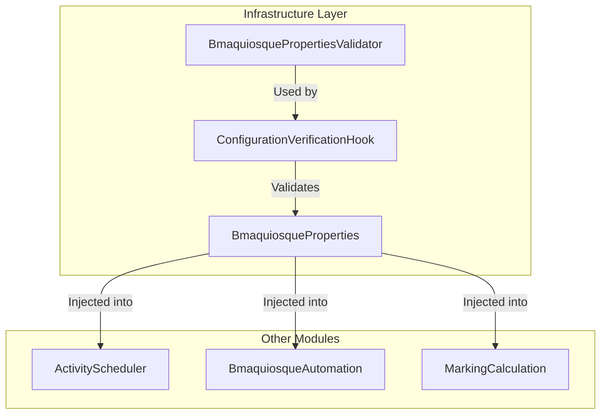

# Feature Technical Specification: single-user-configuration

## Status

Status: Confirmed

Last updated: 2026-07-13

Owner or primary stakeholder: Lucas Dourado

## Product Name

Auto Time Marking

## Feature Reference

`docs/features/single-user-configuration/feature.md`

Target output path: `docs/features/single-user-configuration/tech-spec.md`

## Source Documents

| Source | Location or Reference | Type | Status | Notes |
| --- | --- | --- | --- | --- |
| Feature | [feature.md](file:///c:/Users/lucas.dourado/IdeaProjects/auto-time-marking/docs/features/single-user-configuration/feature.md) | Feature | Confirmed | Primary feature source |
| Project Planning | [project-planning.md](file:///c:/Users/lucas.dourado/IdeaProjects/auto-time-marking/docs/planning/auto-time-marking/project-planning.md) | Planning | Confirmed | MVP context, phases, dependencies |
| Technology Definition | [technology-definition.md](file:///c:/Users/lucas.dourado/IdeaProjects/auto-time-marking/docs/architecture/auto-time-marking/technology-definition.md) | Technology definition | Confirmed | Confirmed stack (Java 21, Spring Boot, Maven) |

## Specification Scope

This specification details the technical design for loading, binding, and validating the configuration properties required by the single-user MVP of the Auto Time Marking backend service. It defines the property schema, validation logic constraints, timezone configuration, error behaviors, and bootstrap hooks required to achieve a fail-fast startup.

## Feature Summary

This feature handles the initialization checklist of the application. It loads settings from the standard Spring Boot `application.properties` (or system environment variables) and binds them to a strongly-typed, immutable-style properties configuration bean. During application bootstrap, the system executes validation checks to verify that the credentials are provided, that the time jitter is non-negative, and that the maximum entry time falls within operational boundaries. If any validation rule fails, the system logs a descriptive error message and terminates the JVM immediately with a non-zero exit code.

## Feature Goal

Load and validate the user's BMAquiosque login credentials, maximum entry time, and marking variation (jitter) parameters from external sources (configuration files or environment variables) on service startup.

## Product Completion Criteria

- [x] Implementation of configuration parser.
- [x] Validation constraints (MVP-VR-001, MVP-VR-002, MVP-VR-003) implemented and covered by unit tests.
- [x] Application exits with status code > 0 and error logging when configuration is invalid.

## Technical Goals

- Bind configurations cleanly using Spring Boot's `@ConfigurationProperties` mechanism.
- Enforce fail-fast initialization: prevent the scheduler or browser automation from starting if properties are missing, malformed, or out of bounds.
- Support seamless override of configuration parameters using standard environment variables.
- Mask sensitive configuration values (like passwords) in bootstrap logs.
- Provide a robust unit testing suite for all validation permutations.

## Non-Goals

- Dynamically reloading configuration properties at runtime without restarting the application.
- Attempting a live dummy login to BMAquiosque during boot validation (this is deferred to `bmaquiosque-automation`).
- Storing credentials in a database or providing interactive management UI (deferred to Phase 2+).

## Confirmed Technology Decisions

| Area | Decision | Source | Applies To | Notes |
| --- | --- | --- | --- | --- |
| Language & Runtime | Java 21 (LTS) | `technology-definition.md` | Whole project | Language base and compiler target |
| Build Tool | Maven | `technology-definition.md` | Build structure | Project build definition (`pom.xml`) |
| Framework | Spring Boot 3.4.x | `technology-definition.md` | Core framework | Runtime container and dependency injection |
| Configuration | properties format | `technology-definition.md` | Configuration | Uses standard `application.properties` |
| Validation | JSR-380 + Custom Logic | `technology-definition.md` | Configuration validation | Combined declarative validation & logical parsing |

## Pending Technology Decisions

| Area | Pending Decision | Impact on Feature | Required Next Step |
| --- | --- | --- | --- |
| None | None | None | None |

## Applicable Guidelines and References

| Reference | Path | Applies To | Usage |
| --- | --- | --- | --- |
| Java/Clean Architecture Guidelines | [.agents/docs/architecture/coding-guidelines/README.md](file:///.agents/docs/architecture/coding-guidelines/README.md) | Package structure | Drives modular class placement |
| Spring Boot Reference | [springboot.md](file:///c:/Users/lucas.dourado/IdeaProjects/auto-time-marking/docs/references/auto-time-marking/technologies/springboot.md) | Config binding | Standard properties parsing guidelines |

## Proposed Technical Approach

The technical approach binds configuration parameters to a dedicated Spring bean, `BmaquiosqueProperties`, using the `@ConfigurationProperties(prefix = "bmaquiosque")` annotation. 

The validation uses a two-tiered approach:
1. **Declarative Validation (Jakarta Validation)**: For basic checks like `@NotBlank` (credentials) and `@Min(0)` (jitter).
2. **Logical Validation (Custom Validator or Lifecycle Hook)**: For parsing and boundary checks on the maximum entry time (e.g., verifying `HH:mm` format and checking that the parsed time falls between `05:00` and `22:00` in the configured timezone context).

To enforce the fail-fast constraint, a validation hook class (implementing Spring's `CommandLineRunner` or `InitializingBean` or a `@PostConstruct` block) will trigger the validator. If any validation constraint is violated, the bootstrap phase throws a custom exception which causes the application context to terminate with a non-zero exit code.

## Architecture Notes

Consistent with the clean architecture Java guidelines:
- The configuration loader represents a technical infrastructure detail.
- It lives under the `configuration` module within the infrastructure layer.
- Class package: `com.lucasbdourado.autotimemarking.modules.configuration.infrastructure.config`
- All other modules requiring configuration (such as `scheduler`, `automation`, and `calculation`) will inject the read-only `BmaquiosqueProperties` bean, ensuring decoupled and direct access to parameters without reloading files.



## Modules and Responsibilities

| Module or Component | Responsibility | Inputs | Outputs | Notes |
| --- | --- | --- | --- | --- |
| `BmaquiosqueProperties` | Strongly-typed container for configuration variables. | `application.properties` / Environment variables | Config fields | Spring `@ConfigurationProperties` bean. |
| `BmaquiosquePropertiesValidator` | Evaluates credentials, checks formats, parses and evaluates max entry time boundaries. | `BmaquiosqueProperties` | Validation errors list (empty if valid) | Logical and structural checks. |
| `ConfigurationVerificationHook` | Spring lifecycle bean triggering validation on context startup and halting on error. | `BmaquiosqueProperties` | JVM Exit Code > 0 (on error) | Executes fail-fast logic. |

## Integration Contracts

No network integrations are required. The only integration is the in-memory dependency injection contract.

| Producer | Consumer | Contract | Notes |
| --- | --- | --- | --- |
| `BmaquiosqueProperties` | System Components | Injected Java Bean exposing read-only configuration methods | Available to other Spring Beans |

## Data Model

`Not applicable` - This feature manages configuration parsing and validation during startup and does not persist data or define domain entities with lifecycles.

## Data Contracts

### Configuration Schema Properties

The following keys will be supported in `application.properties`:

| Property Key | Type | Validation Rules | Description |
| --- | --- | --- | --- |
| `bmaquiosque.username` | String | Not blank | BMAquiosque user login credential |
| `bmaquiosque.password` | String | Not blank | BMAquiosque user password credential |
| `bmaquiosque.max-entry-time` | String | Format `HH:mm`, between `05:00` and `22:00` | Latest allowed entry punch time |
| `bmaquiosque.jitter-minutes` | Integer | Non-negative (>= 0) | Maximum variance applied to markings |
| `bmaquiosque.timezone` | String | Valid `java.time.ZoneId` | Timezone context. Defaults to `America/Sao_Paulo` |

## API or Interface Design

`Not applicable` - This backend configuration loader does not expose REST APIs or communication interfaces.

## State and Error Handling

| State or Error | Trigger | Expected Behavior | User/System Feedback | Notes |
| --- | --- | --- | --- | --- |
| Success Boot | Properties are valid | The context starts; logs config properties (masking password) | `Loaded BMAquiosque configuration. User: [username], Max Entry Time: [maxEntryTime], Jitter: [jitterMinutes] min, Timezone: [timezone].` | Normal operation proceeds |
| Missing/Empty Credentials | `username` or `password` properties are null, empty or blank | Halt boot sequence immediately | Error log: `BMAquiosque configuration error: credentials cannot be blank.` | Triggers JVM shutdown |
| Out of Bounds Jitter | `jitter-minutes` is negative | Halt boot sequence immediately | Error log: `BMAquiosque configuration error: jitter-minutes must be a non-negative integer.` | Triggers JVM shutdown |
| Invalid Max Entry Time format | `max-entry-time` cannot be parsed as `HH:mm` (e.g. `9:00`, `25:00`, `abc`) | Halt boot sequence immediately | Error log: `BMAquiosque configuration error: max-entry-time must be in HH:mm format.` | Triggers JVM shutdown |
| Out of Bounds Max Entry Time | Parsed time is before `05:00` or after `22:00` | Halt boot sequence immediately | Error log: `BMAquiosque configuration error: max-entry-time must be between 05:00 and 22:00.` | Triggers JVM shutdown |
| Invalid Timezone ID | Configured timezone string is not a valid `java.time.ZoneId` | Halt boot sequence immediately | Error log: `BMAquiosque configuration error: timezone is invalid.` | Triggers JVM shutdown |

## Validation Rules

| Validation | Applies To | Enforcement Point | Error Behavior | Notes |
| --- | --- | --- | --- | --- |
| `MVP-VR-001` | `max-entry-time` | Startup Hook (Bootstrap) | Throws `IllegalStateException`, exits JVM | Must be between `05:00` and `22:00` (inclusive). format: `HH:mm` |
| `MVP-VR-002` | `jitter-minutes` | Startup Hook (Bootstrap) | Throws `IllegalStateException`, exits JVM | Must be a non-negative integer (>= 0) |
| `MVP-VR-003` | `username` and `password` | Startup Hook (Bootstrap) | Throws `IllegalStateException`, exits JVM | Must not be empty, null, or blank |
| `Timezone check` | `timezone` | Startup Hook (Bootstrap) | Throws `IllegalStateException`, exits JVM | Must be a valid ZoneId (e.g., `America/Sao_Paulo`) |

## Security and Permissions

- **Credential Exposure Prevention**: Sensitive properties must never be committed in plain text to source control. Developers and users should inject credentials using environment variables mapped inside `application.properties`:
  ```properties
  bmaquiosque.username=${BMAQUIOSQUE_USERNAME:}
  bmaquiosque.password=${BMAQUIOSQUE_PASSWORD:}
  ```
- **Log Masking**: The configuration startup log must omit or mask the password value (e.g., displaying `[PROTECTED]` or `*****`) to prevent leaking credentials to application log files.

## Observability and Logging

| Signal | Purpose | Source | Consumer | Notes |
| --- | --- | --- | --- | --- |
| Success Log | Confirms configuration loaded correctly on boot | `ConfigurationVerificationHook` | Console/Log File | Includes all parameters except password |
| Error Log | Prints reasons for startup failure | `ConfigurationVerificationHook` | Console/Stderr | Detailed list of validation errors |

## Performance Considerations

- The validation logic runs exactly once during the application startup lifecycle. The performance footprint is negligible.

## Compatibility and Migration Notes

`Not applicable` - This is the initial greenfield phase of the project; no backward compatibility or migration is required.

## Testing Strategy

All validation rules must be covered by robust unit tests.

| Test Type | What to Validate | Required? | Notes |
| --- | --- | --- | --- |
| Unit | Validate `BmaquiosquePropertiesValidator` against invalid usernames, passwords, jitter values, and invalid/out-of-bounds times. | Yes | Uses JUnit 5. Testing various scenarios (blank username, negative jitter, invalid time format, out of bounds time). |
| Integration | Validate that Spring Boot fails to start when context is booted with invalid configuration properties. | Yes | Uses `@SpringBootTest` with test properties. |

## Risks and Trade-offs

| Risk or Trade-off | Impact | Likelihood | Mitigation or Follow-Up | Status |
| --- | --- | --- | --- | --- |
| Unsecure local storage of credentials | Medium | Medium | Mitigate by emphasizing environment variables injection. | Mitigated |
| Timezone mismatch between server runtime and config | Medium | Low | Introduce explicit `bmaquiosque.timezone` property to decouple from OS timezone settings. | Mitigated |

## Assumptions

- The target runtime environment supports standard Java environment variable resolution.
- If not explicitly set, the timezone default is assumed to be `America/Sao_Paulo`.

## Open Questions

- None. All requirements for the startup configuration parameters and boundaries are fully defined.

## Feature Technical Readiness

Status: Ready for Task Breakdown

Reason: All properties, business constraints, validation logic rules, package definitions, and testing requirements for the configuration module have been specified and align with Harness standards.

## Feature Technical Readiness Checklist

- [x] Feature scope is clear.
- [x] Product completion criteria are understood.
- [x] Technology decisions are confirmed.
- [x] Applicable guidelines and references are listed.
- [x] Integration contracts are defined or marked as not applicable.
- [x] Data model is defined or marked as not applicable.
- [x] Data contracts are defined or marked as not applicable.
- [x] State and error handling are defined.
- [x] Validation rules are defined or marked as not applicable.
- [x] Security/permission considerations are defined or marked as not applicable.
- [x] Testing strategy is defined.
- [x] Blocking open questions are resolved.
- [x] Inputs for `create-tasks` are clear.

## Inputs for Create Tasks

- Create task for properties configuration class `BmaquiosqueProperties` binding.
- Create task for implementing `BmaquiosquePropertiesValidator` validation checks (JSR-380 annotations + max-entry-time parsing).
- Create task for configuring the startup verification lifecycle hook (`ConfigurationVerificationHook`) to perform fail-fast checks.
- Create task for log message formatting and password masking.
- Create task for validation unit tests and integration tests.

## ADR Candidates

| Candidate ADR | Decision Area | Status | Reason |
| --- | --- | --- | --- |
| ADR-003 | Configuration Strategy | Ready for ADR | Details how sensitive credentials and parameters are loaded via environment properties. |

## Next Recommended Steps

- Proceed to the **Task Breakdown** (`create-tasks`) phase for this feature.
